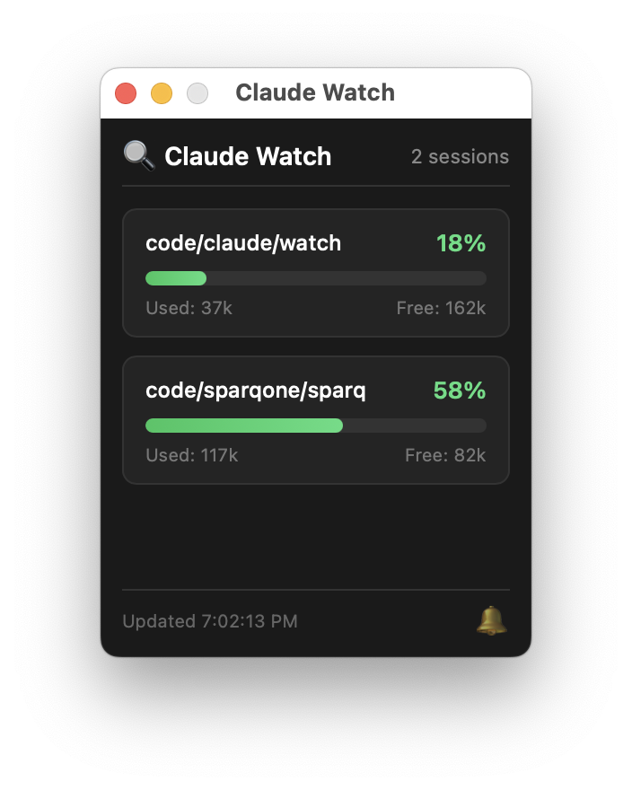

# Claude Watch

A lightweight, cross-platform desktop app that monitors Claude Code context usage across all your active sessions.



## Why?

When working with AI coding assistants on complex tasks, context management becomes critical. Claude Code has a ~200k token context window, and when it fills up, Claude automatically compacts the conversation—often losing important details you wanted to preserve.

**Claude Watch** gives you visibility into your context usage across all active sessions, so you can intentionally save your work before Claude does it for you.

When you get the warning, tell Claude:

*Write everything we did so far to progress.md, ensure to note the approach we're taking, the steps we've done so far, and the current failure we're working on.*

### The RPI Framework

This tool pairs well with the **Research-Plan-Implement (RPI) Framework**—a structured methodology for working with Claude Code:

| Phase | Purpose |
|-------|---------|
| **Research** | Deeply understand the codebase before making changes |
| **Plan** | Create detailed, validated implementation plans |
| **Implement** | Execute plans methodically, phase by phase |

Without structure, AI-assisted development often becomes chaotic: context gets lost between sessions, no clear methodology for multi-file changes, and painful handoffs when stopping mid-task.

**Learn more:**
- [Watch the RPI methodology video](https://www.youtube.com/watch?v=rmvDxxNubIg)
- [RPI Framework for Claude Code](https://github.com/acampb/claude-rpi-framework)

## Features

- 🖥️ **Floating window** - Always on top, stays visible while you work
- 📊 **Real-time monitoring** - Updates every 2 seconds
- 🔔 **Smart alerts** - Notification + sound at 75% and 90% context usage
- 🌍 **Cross-platform** - Works on macOS, Windows, and Linux
- 🚀 **Lightweight** - ~10MB binary, minimal resource usage
- 📁 **Multi-project** - Monitors all active Claude Code sessions automatically

## Installation

> **Note**: Only tested on macOS. Windows build provided but untested. Linux requires building from source on a Linux machine—contributions welcome!

### Pre-built Binaries

Download from the `releases/` folder:
- **macOS**: `claude-watch-macos.zip` (Universal - Intel + Apple Silicon)
- **Windows**: `claude-watch-windows.zip`

### Build from Source

**Prerequisites:**
- [Go 1.21+](https://go.dev/dl/)
- [Wails CLI](https://wails.io/docs/gettingstarted/installation): `go install github.com/wailsapp/wails/v2/cmd/wails@latest`
- **macOS**: Xcode command line tools (`xcode-select --install`)
- **Windows**: WebView2 (usually pre-installed on Windows 10/11)
- **Linux**: `sudo apt install libgtk-3-dev libwebkit2gtk-4.0-dev`

```bash
# Clone or download this project
cd claude-watch

# Development mode (hot reload)
make dev

# Build for your current platform
make build

# Build for all platforms
make build-all
```

### Install (macOS)

```bash
make install-mac
# App will be available in /Applications
```

## Usage

1. **Launch the app** - Double-click `claude-watch.app` (macOS) or `claude-watch.exe` (Windows)
2. **Window auto-positions** - Opens in the top-right corner (drag to reposition if needed)
3. **Work normally** - The app monitors all Claude Code sessions in the background
4. **Get alerted** - At 75% and 90% context, you'll receive:
   - System notification
   - Audio alert
   - Voice warning (macOS at 90%)

### What it monitors

The app scans `~/.claude/projects/` for active sessions (modified in the last 60 minutes) and calculates context usage by:
- Summing all output tokens (they accumulate in context)
- Adding current input + cache tokens
- Displaying as percentage of 200k token limit

## Configuration

Currently, configuration is done by editing the source:

| Setting | Location | Default |
|---------|----------|---------|
| Update interval | `frontend/main.js` | 2000ms |
| Active session cutoff | `monitor.go` | 60 minutes |
| Max projects shown | `monitor.go` | 10 |
| Context limit | `monitor.go` | 200,000 tokens |

## Project Structure

```
claude-watch/
├── main.go           # Wails entry point
├── app.go            # Core app + notifications
├── monitor.go        # JSONL parsing logic
├── frontend/
│   ├── index.html    # UI structure
│   ├── style.css     # Styling
│   └── main.js       # Update logic
├── wails.json        # Wails config
├── go.mod            # Go dependencies
└── Makefile          # Build commands
```

## Development

```bash
# Run with hot reload
make dev

# The app will open and refresh when you edit files
```

## Troubleshooting

### "No active Claude sessions"
- Sessions must be modified within the last 60 minutes
- Check that Claude Code is storing sessions in `~/.claude/projects/`

### Notifications not working
- **macOS**: Grant notification permissions in System Preferences
- **Windows**: Check notification settings in Windows Settings
- **Linux**: Ensure `notify-send` is installed

### Build errors
- Run `wails doctor` to diagnose missing dependencies
- Ensure Go and Wails are in your PATH

## License

MIT License - Feel free to modify and distribute.

## Contributing

Pull requests welcome! Ideas for future features:
- [ ] System tray mode
- [ ] Configurable thresholds
- [ ] Session naming/labels
- [ ] Export context summary
- [ ] MCP server integration
